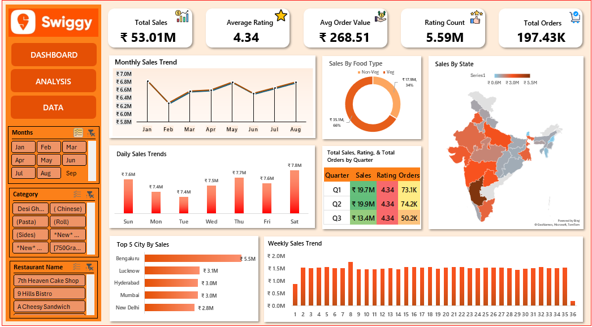

# 📊 Swiggy Sales Analysis (Excel Dashboard)
## Overview
This project presents a comprehensive sales analysis for Swiggy using advanced Excel techniques. The dashboard visualizes key performance metrics, customer behavior, and regional trends to support strategic decision-making.

## Dashboard Preview

## 🎯 Objectives
- Analyze Swiggy’s sales performance across time, geography, and food categories
- Identify top-performing cities and states
- Understand customer ratings and order patterns
- Deliver actionable insights through a dynamic Excel dashboard

## 📁 Data Summary
- Source: Raw sales data from Swiggy
- File: Swiggy Raw Data Excel.xlsx
- Size: ~32 MB (tracked via Git LFS)
- Fields: Order value, food type, location, rating, timestamp, restaurant name

## 📈 Key Insights from the Dashboard
🚀 Top-Level Metrics
|  |  | 
|  |  | 
|  |  | 
|  |  | 
|  |  | 
|  |  | 

## 📅 Time-Based Trends
- Monthly Sales: Stable performance from Jan–Aug, peaking near ₹7.0M
- Weekly Sales: Gradual growth with fluctuations, ranging from ₹0.5M to ₹2.0M
- Quarterly Breakdown: Q1 and Q2 show consistent strength (~₹19.8M each), Q3 dips to ₹13.4M

## 🗺️ Regional Performance
- Top Cities by Sales:
- Bengaluru (₹5.5M)
- Lucknow, Hyderabad, Mumbai, New Delhi (~₹2.8M–₹3.1M)
- State-Level Sales: ₹2.0M–₹3.5M range, visualized via heat map

## 🍽️ Category Insights
- Food Type Split:
- Veg: ₹35.1M (66%)
- Non-Veg: ₹17.9M (34%)
- Popular Categories: Desi Ghar, Chinese, Pasta, Rolls, Sides

## 📊 Daily Patterns
- Sales are highest mid-week (₹7.4M–₹7.8M), indicating strong weekday demand

## 📌 How to Use
- Clone the repository:
git clone https://github.com/Gurunandan08/Swiggy-Sales-Analysis.git

- Install Git LFS:
git lfs install
- Pull the Excel file:
git lfs pull

Open Swiggy Raw Data Excel.xlsx in Excel to explore the dashboard

